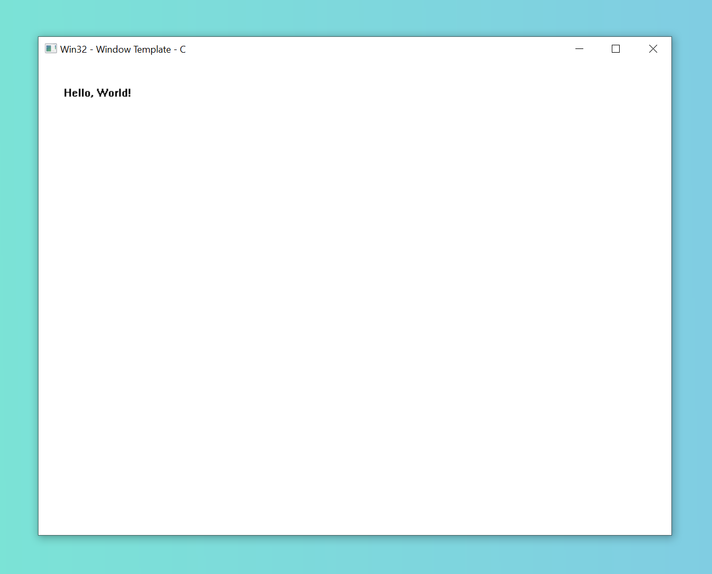

# Win32 Window Template C (x64, C17)

* created with Visual Studio 2022 Community
* configured for x64
* Unicode (default) and ASCII compatible (e.g. using `WNDCLASSEX` macro instead of `WNDCLASSEXA` or `WNDCLASSEXW` directly)
* with basic error logging (`GetLastError` and `OutputDebugString`)
* DPI awareness: None

Using this template you will get the following window on `Windows 10` (without the gradient background color surrounding the window).

